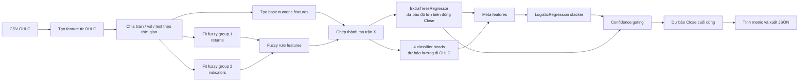
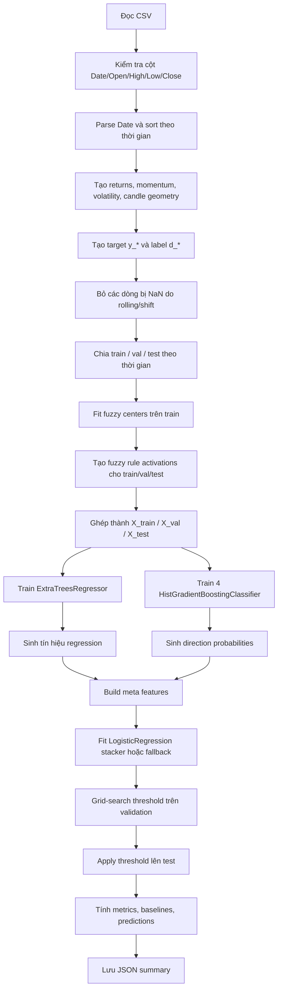
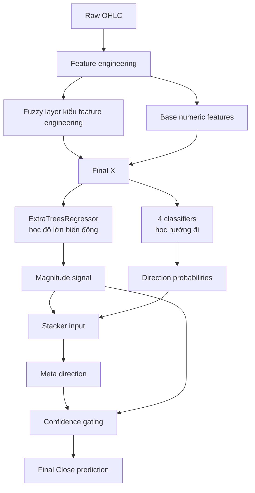

# Hướng dẫn học `model_2.py` cho người mới

Tài liệu này giải thích `model_2.py` theo hướng dễ học cho người mới làm quen với ML, time series, fuzzy logic, và hybrid model.

Nếu bạn chỉ cần bản tóm tắt ngắn, xem:

- [`docs/model_2_overview.md`](/C:/Users/Admin/Downloads/fuzzy-ANFIS-hybrid-model/docs/model_2_overview.md)

## 1. Model này đang cố làm gì?

Mục tiêu chính của `model_2.py` là:

- dự báo `Close` của ngày kế tiếp
- đồng thời cải thiện dự báo hướng đi của giá: tăng hay giảm

Nói đơn giản:

- một phần của model học "ngày mai giá sẽ lệch bao nhiêu"
- một phần khác học "ngày mai khả năng cao là tăng hay giảm"
- cuối cùng model ghép hai ý này lại

Đây là lý do file được gọi là hybrid:

- không dùng một model duy nhất
- mà kết hợp nhiều model chuyên từng nhiệm vụ nhỏ

## 2. Cần hiểu những khái niệm nào trước?

### 2.1 OHLC là gì?

OHLC là 4 giá cơ bản trong một cây nến:

- `Open`: giá mở cửa
- `High`: giá cao nhất
- `Low`: giá thấp nhất
- `Close`: giá đóng cửa

Model này chỉ dùng dữ liệu sinh ra từ OHLC. Nó không dùng:

- tin tức
- macro
- sentiment
- volume gốc riêng biệt ngoài những gì đã có trong CSV hiện tại

### 2.2 Feature là gì?

Feature là một biến số đầu vào cho model.

Ví dụ:

- `Close_ret1`: phần trăm thay đổi của Close so với 1 ngày trước
- `vol5`: độ biến động của `Close_ret1` trong 5 ngày
- `range_pct`: biên độ `High - Low` so với `Close`

Raw data thường chưa đủ tốt để model học trực tiếp. Vì vậy ta phải tạo feature từ dữ liệu gốc.

### 2.3 Regression và classification khác nhau thế nào?

Regression:

- dự đoán một số thực
- ở đây là giá `Close` hoặc log-return của `Close`

Classification:

- dự đoán một nhãn
- ở đây là `1 = tăng`, `0 = không tăng`

`model_2.py` dùng cả hai.

### 2.4 Train / Validation / Test là gì?

- `train`: dùng để fit model
- `validation`: dùng để chọn threshold/cấu hình
- `test`: dùng để đánh giá cuối cùng

Với chuỗi thời gian, thứ tự thời gian rất quan trọng.

Ta không được shuffle ngẫu nhiên như bài toán tabular thông thường.

Ta phải tách theo thứ tự:

```text
quá khứ xa hơn -> train
quá khứ gần hơn -> validation
gần hiện tại nhất -> test
```

Lý do:

- không được để model "nhìn thấy tương lai" khi học

## 3. Kiến trúc tổng thể của model



## 4. Tại sao không dùng một model duy nhất?

Vì bài toán này có hai phần hơi khác nhau:

### 4.1 Phần độ lớn biến động

Ta muốn biết:

- ngày mai lệch bao nhiêu so với hôm nay

Đây là bài toán regression.

### 4.2 Phần hướng đi

Ta muốn biết:

- tăng hay giảm

Đây là bài toán classification.

Trong thực tế:

- có những lúc model dự đoán độ lớn khá ổn
- nhưng lại sai hướng

Nên script này tách hai phần:

- regressor học độ lớn
- classifier/meta-model học hướng

Sau đó ghép chúng lại.

## 5. Vì sao lại có “ANFIS-style fuzzy features”?

ANFIS đầy đủ thường là một hệ neuro-fuzzy có lớp membership, lớp rule, lớp normalization, lớp consequent.

Nhưng `model_2.py` không cài một mạng ANFIS đầy đủ theo kiểu deep learning.

Thay vào đó, nó dùng ý tưởng của ANFIS:

- biến feature thành các membership mềm
- kết hợp các membership thành fuzzy rules
- dùng các rule activations như feature đầu vào cho model downstream

Nói ngắn gọn:

- code này mang “tinh thần ANFIS”
- chứ không phải full neural ANFIS train end-to-end

## 6. Fuzzy membership là gì?

Trong logic thông thường:

- một giá trị hoặc thuộc tập “Low”, hoặc không

Trong fuzzy logic:

- một giá trị có thể thuộc “Low” với mức 0.2
- đồng thời thuộc “Medium” với mức 0.7
- và thuộc “High” với mức 0.1

Ví dụ:

- nếu `Close_ret1 = 0.8%`
- ta có thể nói nó “hơi cao”, chứ không nhất thiết chỉ “cao” hoặc “không cao”

Trong code, membership được tính bằng hàm Gaussian:

```text
mu(x) = exp(- (x - center)^2 / (2 * width^2))
```

Trực giác:

- càng gần `center` thì membership càng gần 1
- càng xa `center` thì membership càng về 0

## 7. Fuzzy rule được tạo như thế nào?

Giả sử ta có 2 feature:

- `A`
- `B`

Mỗi feature có 2 membership:

- low
- high

Khi đó ta có 4 luật:

1. `A_low AND B_low`
2. `A_low AND B_high`
3. `A_high AND B_low`
4. `A_high AND B_high`

Trong code, toán tử `AND` mềm được làm bằng phép nhân:

```text
rule_strength = mu_A * mu_B
```

Nếu một sample khớp mạnh với cả hai membership thì tích sẽ lớn.

Nếu khớp yếu với một vế, rule sẽ yếu đi.

Sau đó tất cả rule được chuẩn hóa để tổng bằng 1 cho mỗi dòng dữ liệu.

## 8. `model_2.py` tạo những feature nào?

### 8.1 Nhóm feature cơ bản

Script tạo các nhóm chính sau:

- return ngắn hạn: `ret1`, `ret2`, `ret5`
- momentum: `mom3`, `mom5`, `mom10`, `mom20`
- volatility: `vol3`, `vol5`, `vol10`, `vol20`
- hình học nến:
  - `range_pct`
  - `gap`
  - `intraday`
  - `upper_wick`
  - `lower_wick`
- vị trí Bollinger tương đối:
  - `bb_pos`

### 8.2 Nhóm fuzzy returns

Nhóm này gồm:

- `Close_ret1`
- `Open_ret1`
- `High_ret1`
- `Low_ret1`

Ý nghĩa:

- mô tả trạng thái biến động rất gần của OHLC

### 8.3 Nhóm fuzzy indicators

Nhóm này gồm:

- `range_pct`
- `gap`
- `intraday`
- `vol5`

Ý nghĩa:

- mô tả hình dạng nến và mức biến động gần đây

## 9. Vì sao dùng KMeans để đặt tâm fuzzy?

Muốn có membership Gaussian thì cần:

- tâm `center`
- độ rộng `width`

Ở đây script dùng `KMeans` để tìm các vùng đại diện của từng feature.

Ví dụ:

- nếu return thường nằm quanh `-2%`, `0%`, `+2%`
- KMeans có thể tìm ra các tâm gần những vùng này

Nếu KMeans lỗi, script fallback sang quantile.

Ý tưởng của quantile:

- lấy các mốc thấp / trung bình / cao theo phân phối dữ liệu

## 10. Base features và fuzzy features được ghép ra sao?

Sau khi có:

- base numeric features
- fuzzy rule features của nhóm returns
- fuzzy rule features của nhóm indicators

ta ghép ngang chúng lại thành ma trận `X`:

```text
X = [base_features | ret_rule_features | ind_rule_features]
```

Mỗi dòng của `X` ứng với một ngày dữ liệu sau khi đã tạo đủ rolling feature và target.

## 11. Regresor làm nhiệm vụ gì?

Script dùng `ExtraTreesRegressor`.

Nhiệm vụ:

- dự báo `log(next_close / current_close)`

Đây không phải dự báo giá trực tiếp, mà là dự báo log-return.

### Vì sao log-return?

Vì log-return thường tiện hơn:

- ổn định số học hơn
- dễ so sánh giữa asset giá cao và asset giá thấp
- khi dựng lại giá chỉ cần `exp(...)`

Công thức:

```text
pred_ret = model(X)
pred_close = current_close * exp(pred_ret)
```

## 12. Vì sao lại cần 4 direction heads?

Script huấn luyện 4 classifier riêng cho:

- `d_Close`
- `d_Open`
- `d_High`
- `d_Low`

Điều này tạo ra 4 “góc nhìn” về hướng thị trường.

Ví dụ:

- có lúc `Close` không tăng mạnh
- nhưng `High` vẫn có khả năng tăng

Những xác suất này được dùng như tín hiệu đầu vào cho tầng meta-model.

## 13. Meta model đang học cái gì?

Meta model là `LogisticRegression`.

Nó không học trực tiếp từ giá gốc, mà học từ:

- xác suất tăng của `Close`
- xác suất tăng của `Open`
- xác suất tăng của `High`
- xác suất tăng của `Low`
- chênh lệch `High_prob - Low_prob`
- một tín hiệu mềm lấy từ regressor

Trực giác:

- nếu nhiều model con cùng nói “có khả năng tăng”
- meta model có thể học rằng xác suất tăng cuối cùng cao

Đây là stacking:

- model tầng dưới tạo ra “ý kiến”
- model tầng trên học cách tổng hợp các “ý kiến” đó

## 14. Confidence gating là gì?

Đây là phần rất quan trọng của script.

Meta model không phải lúc nào cũng đáng tin.

Nên script không dùng meta model mọi lúc.

Nó chỉ dùng meta model khi xác suất đủ xa 0.5:

```text
confidence = abs(p_meta - 0.5) * 2
```

Nếu confidence cao:

- dùng hướng của meta model

Nếu confidence thấp:

- quay lại dùng hướng ngầm suy ra từ regressor

Nghĩa là:

- regressor cung cấp độ lớn biến động
- meta model chỉ được quyền “lật dấu” khi thật sự tự tin

## 15. Cách dựng lại giá `Close` cuối cùng

Regressor dự đoán độ lớn ở không gian return.

Meta/gating quyết định hướng.

Sau đó script ghép hai thứ lại:

```text
if direction == up:
    pred_close = current_close * exp(abs(pred_ret))
else:
    pred_close = current_close * exp(-abs(pred_ret))
```

Ý nghĩa:

- giữ độ lớn biến động từ regressor
- nhưng có thể đổi hướng dự đoán nếu meta model thuyết phục hơn

## 16. Validation objective đang tối ưu cái gì?

Threshold search không chỉ tối ưu một metric.

Script dùng hàm điểm:

```text
score = DA - 250 * max(0, 0.95 - R2) - 4 * abs(Precision - Recall)
```

### Ý nghĩa từng phần

`DA`:

- muốn hướng đi đúng càng nhiều càng tốt

`- 250 * max(0, 0.95 - R2)`:

- nếu `R2` thấp hơn `0.95`, phạt rất mạnh
- nghĩa là tác giả muốn tránh trường hợp hướng đúng nhưng giá trị số bị lệch quá nhiều

`- 4 * abs(Precision - Recall)`:

- phạt mất cân bằng giữa precision và recall

Nói cách khác:

- model được ưu tiên dự đoán đúng hướng
- nhưng vẫn phải giữ chất lượng regression đủ tốt

## 17. Tại sao phải có baseline?

Baseline là các cách dự báo rất đơn giản.

Ở đây có 2 baseline:

### 17.1 Close persistence

```text
ngày mai Close = hôm nay Close
```

Đây là baseline rất cơ bản.

### 17.2 Trend persistence

```text
nếu hôm nay tăng so với hôm qua thì mai tiếp tục tăng
nếu hôm nay giảm so với hôm qua thì mai tiếp tục giảm
```

Nếu model phức tạp không tốt hơn baseline, thì model đó chưa thực sự có giá trị.

## 18. Activity flow chi tiết



## 19. Ví dụ trực giác với một sample

Giả sử ngày hiện tại có:

- `Close_ret1 = +1.2%`
- `Open_ret1 = +0.4%`
- `High_ret1 = +1.5%`
- `Low_ret1 = -0.3%`
- `range_pct = 2.1%`
- `gap = 0.5%`
- `intraday = 0.8%`
- `vol5 = 1.9%`

### Bước 1: membership

Ví dụ `Close_ret1 = +1.2%` có thể cho ra:

- low: `0.10`
- high: `0.90`

`range_pct = 2.1%` có thể cho ra:

- low: `0.25`
- high: `0.75`

### Bước 2: rule strength

Một rule có thể là:

```text
Close_ret1_high AND Open_ret1_high AND High_ret1_high AND Low_ret1_low
```

Nếu membership tương ứng là:

- `0.90`
- `0.70`
- `0.85`
- `0.60`

thì strength xấp xỉ:

```text
0.90 * 0.70 * 0.85 * 0.60 = 0.3213
```

Các rule khác cũng được tính tương tự rồi chuẩn hóa.

### Bước 3: regressor

Regressor có thể dự báo:

```text
pred_ret = +0.018
```

nghĩa là:

- độ lớn dự báo gần khoảng `+1.8%`

### Bước 4: direction heads

Ví dụ:

- `P(Close up) = 0.61`
- `P(Open up) = 0.57`
- `P(High up) = 0.72`
- `P(Low up) = 0.38`

### Bước 5: meta model

Meta model đọc các xác suất trên và cho:

```text
p_meta = 0.68
```

### Bước 6: confidence gating

```text
confidence = abs(0.68 - 0.5) * 2 = 0.36
```

Nếu `conf_thr = 0.40`:

- chưa đủ tự tin
- giữ hướng từ regressor

Nếu `conf_thr = 0.30`:

- đủ tự tin
- dùng hướng từ meta model

## 20. Cách đọc từng hàm trong code

Nếu bạn muốn đọc file theo thứ tự dễ học, hãy đọc như sau:

1. `prepare_ohlc_features()`
2. `build_time_split()`
3. `fit_fuzzy_group()`
4. `compute_fuzzy_rules()`
5. `build_feature_matrix()`
6. `train_close_regressor()`
7. `train_direction_heads()`
8. `build_meta_features()`
9. `fit_meta_direction_model()`
10. `tune_direction_strategy()`
11. `apply_direction_strategy()`
12. `run_trial()`
13. `run_search()`
14. `main()`

Đây là thứ tự gần với luồng suy nghĩ hơn là thứ tự import hay helper nhỏ.

## 21. Cách đọc file output JSON

Sau khi chạy, script tạo file:

```text
<output-dir>/<stock>_anfis_hybrid_ohlc_metrics.json
```

Các phần quan trọng:

### `search_space`

Cho biết script đã thử những gì:

- `min_date_grid`
- `train_ratio_grid`
- `seed_grid`
- `n_mfs`

### `best_trial`

Trial tốt nhất theo logic xếp hạng của script.

### `best_close_metrics`

Metric chính của `Close`, gồm:

- `MSE`
- `RMSE`
- `MAE`
- `MAPE`
- `R2`
- `DA`
- `Precision`
- `Recall`
- `F1`

### `threshold_selection`

Ngưỡng được chọn trên validation:

- `conf_thr`
- `dir_thr`
- `val_score`

### `predictions`

Danh sách dự báo ở test:

- `y_true_close`
- `y_pred_close`
- `y_true_dir_close`
- `y_pred_dir_close`
- `curr_close`

## 22. Ý nghĩa các metric

### `MAE`

Sai số tuyệt đối trung bình.

- càng thấp càng tốt

### `RMSE`

Phạt mạnh hơn với lỗi lớn.

- càng thấp càng tốt

### `MAPE`

Sai số tương đối theo phần trăm.

- dễ diễn giải
- nhưng có thể nhạy nếu giá trị thật quá gần 0

### `R2`

Đo mức độ giải thích biến thiên của dữ liệu.

Gần đúng:

- `1.0`: rất tốt
- `0.0`: gần như chỉ bằng dự báo trung bình
- âm: còn tệ hơn cả dự báo trung bình

### `DA`

Directional Accuracy:

- tỉ lệ dự báo đúng hướng tăng/giảm

### `Precision`

Trong các lần model nói “tăng”, bao nhiêu lần là tăng thật.

### `Recall`

Trong các lần thị trường thật sự tăng, model bắt được bao nhiêu lần.

### `F1`

Điểm cân bằng giữa precision và recall.

## 23. Điểm mạnh của kiến trúc này

- có tính diễn giải tốt hơn model black-box thuần túy
- tận dụng fuzzy rule để biểu diễn trạng thái thị trường mềm
- tách riêng magnitude và direction
- có validation-based gating thay vì tin meta-model mù quáng

## 24. Điểm yếu / giới hạn

- feature engineering vẫn khá thủ công
- fuzzy rule count tăng rất nhanh nếu tăng số feature hoặc `n_mfs`
- chưa có walk-forward evaluation đúng nghĩa production
- chưa có calibration analysis kỹ cho các xác suất classifier
- chỉ báo và target hiện vẫn chủ yếu xoay quanh `Close`

## 25. Những câu hỏi nên tự hỏi khi học tiếp

1. Nếu tăng `n_mfs`, số lượng fuzzy rules tăng ra sao?
2. Nếu bỏ fuzzy features, metric thay đổi thế nào?
3. Nếu bỏ meta-model, chỉ giữ regressor thì sao?
4. Nếu chỉ dùng direction head cho `Close`, có đủ không?
5. Nếu đổi `ExtraTreesRegressor` sang `XGBoost` hoặc `LightGBM`, kết quả có cải thiện không?
6. Nếu đánh giá theo walk-forward rolling windows, độ ổn định còn giữ được không?

## 26. Lộ trình học file này hiệu quả

Nếu bạn mới học ML, nên đi theo thứ tự:

### Giai đoạn 1: hiểu bài toán

- hiểu OHLC
- hiểu regression vs classification
- hiểu train/validation/test

### Giai đoạn 2: hiểu feature engineering

- đọc kỹ `prepare_ohlc_features()`
- tự tính tay vài feature trên một đoạn dữ liệu nhỏ

### Giai đoạn 3: hiểu fuzzy logic cơ bản

- hiểu membership function
- hiểu soft rule
- hiểu normalization

### Giai đoạn 4: hiểu stacking

- model tầng 1 dự báo gì?
- model tầng 2 dự báo gì?
- gating giúp giảm lỗi kiểu nào?

### Giai đoạn 5: hiểu evaluation

- đọc kỹ `compute_close_metrics()`
- hiểu vì sao phải so với baseline

## 27. Sơ đồ “ai làm gì” trong model



## 28. Kết luận ngắn

`model_2.py` không phải là một model đơn lẻ.

Nó là một pipeline gồm 4 lớp ý tưởng:

1. tạo feature từ OHLC
2. thêm fuzzy rule features để biểu diễn trạng thái thị trường mềm
3. dùng regressor để học độ lớn biến động
4. dùng classifier + stacker + gating để sửa hướng dự báo

Nếu bạn muốn, bước tiếp theo tôi có thể làm thêm một trong ba hướng:

- viết tiếp một tài liệu “đọc code từng dòng” cho `run_trial()`
- thêm comment theo kiểu tiếng Việt ngay từng khối trong `model_2.py`
- tạo một notebook/demo nhỏ với dữ liệu giả để bạn thấy từng bước biến đổi số liệu
