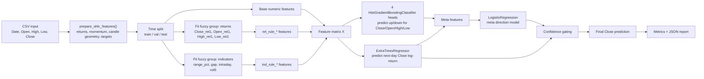
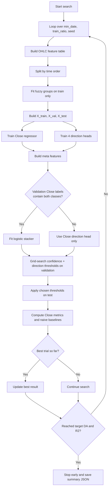

# `model_2.py` Overview

`model_2.py` is an OHLC-only hybrid forecasting pipeline for the next trading day `Close`.
It combines:

- ANFIS-style fuzzy rule features built from compact OHLC-derived groups
- a tree regressor for next-day `Close` magnitude
- four direction classifiers (`Close`, `Open`, `High`, `Low`)
- a logistic meta model that decides when direction signals should override the regressor sign

If you are new to ML or fuzzy systems, read the beginner-friendly Vietnamese guide:

- [`docs/model_2_beginner_guide_vi.md`](/C:/Users/Admin/Downloads/fuzzy-ANFIS-hybrid-model/docs/model_2_beginner_guide_vi.md)

## 1. High-level architecture



## 2. Model activities



## 3. Feature blocks

### Raw/base features

The model keeps all engineered numeric columns except:

- `Date`
- `y_*` next-day regression targets
- `d_*` next-day direction labels

That means the base block includes:

- current OHLC values
- `ret1`, `ret2`, `ret5` for each OHLC field
- `mom3`, `mom5`, `mom10`, `mom20`
- `vol3`, `vol5`, `vol10`, `vol20`
- candlestick geometry such as `range_pct`, `gap`, `intraday`, `upper_wick`, `lower_wick`
- `bb_pos`

### Fuzzy groups

Two fuzzy groups are used so the rule count stays interpretable and manageable.

| Group | Input columns | Rule count |
| --- | --- | --- |
| Returns | `Close_ret1`, `Open_ret1`, `High_ret1`, `Low_ret1` | `n_mfs^4` |
| Indicators | `range_pct`, `gap`, `intraday`, `vol5` | `n_mfs^4` |

Each feature in a group gets `n_mfs` Gaussian membership functions.
The script estimates membership centers with `KMeans` and falls back to quantiles if clustering fails.
For each group, every membership combination becomes one fuzzy rule. Rule activations are normalized row-wise before they are concatenated into the feature matrix.

## 4. Prediction logic

### Magnitude branch

- The regressor predicts `log(next_close / current_close)`.
- That output defines the expected movement size.

### Direction branch

- Four direction heads predict whether next-day `Close`, `Open`, `High`, and `Low` move up or not.
- Their probabilities are stacked with:
  - the `High - Low` probability gap
  - a squashed version of the regression return

### Final decision

The final `Close` direction uses two checks:

1. If the meta model confidence is high enough, use the meta-model direction.
2. Otherwise, keep the regressor direction.

The final `Close` price keeps the absolute move size from the regressor and only changes the sign:

```text
pred_close = current_close * exp(abs(pred_ret))   if direction = up
pred_close = current_close * exp(-abs(pred_ret))  if direction = down
```

## 5. Validation objective

Threshold tuning is done only on the validation slice.
Each candidate pair `(conf_thr, dir_thr)` is scored with:

```text
score = DA - 250 * max(0, 0.95 - R2) - 4 * abs(Precision - Recall)
```

Interpretation:

- prefer higher direction accuracy (`DA`)
- heavily penalize weak `R2`
- lightly penalize precision/recall imbalance

## 6. Outputs

Per successful run, the script stores:

- split sizes
- model configuration
- fuzzy-group metadata
- selected validation thresholds
- naive baselines
- final `Close` metrics
- test-set predictions for `Close`

At the end of the search, `main()` writes a single JSON summary:

```text
<output-dir>/<stock>_anfis_hybrid_ohlc_metrics.json
```

## 7. Quick map from function to responsibility

| Function | Responsibility |
| --- | --- |
| `prepare_ohlc_features()` | Build engineered OHLC features and next-day targets |
| `fit_fuzzy_group()` | Fit Gaussian membership parameters on train data |
| `compute_fuzzy_rules()` | Convert one feature group into normalized rule activations |
| `build_feature_matrix()` | Merge base features with fuzzy rule features |
| `train_close_regressor()` | Train the magnitude model for `Close` |
| `train_direction_heads()` | Train the four direction classifiers |
| `fit_meta_direction_model()` | Train or fall back for the `Close` direction stacker |
| `tune_direction_strategy()` | Search the best confidence and direction thresholds |
| `apply_direction_strategy()` | Produce final direction and `Close` prediction on test |
| `run_search()` | Execute the grid search and early-stop when targets are met |

## 8. Typical CLI usage

```bash
python model_2.py \
  --data-path path/to/ohlc.csv \
  --stock BTC \
  --output-dir outputs \
  --target-da 60 \
  --target-r2 0.95 \
  --min-date-grid 2013-04-01,2015-01-01,2018-01-01 \
  --train-ratio-grid 0.94,0.92,0.90 \
  --val-ratio 0.03 \
  --seed-grid 42,7,21,77,99 \
  --n-mfs 2
```
