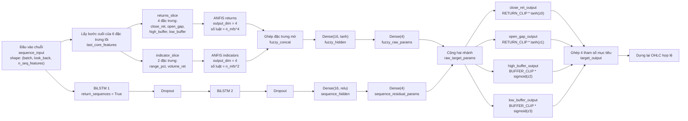
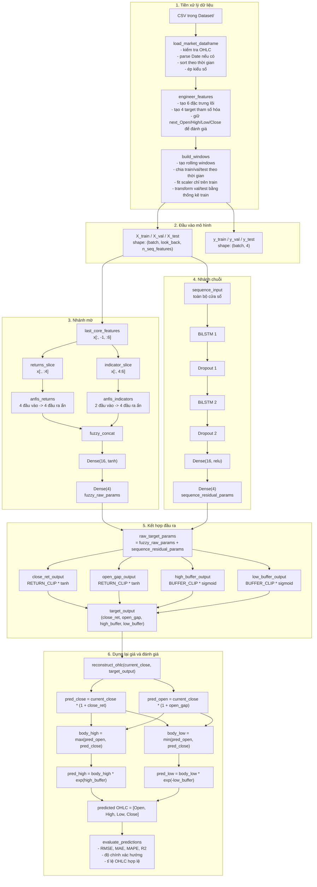
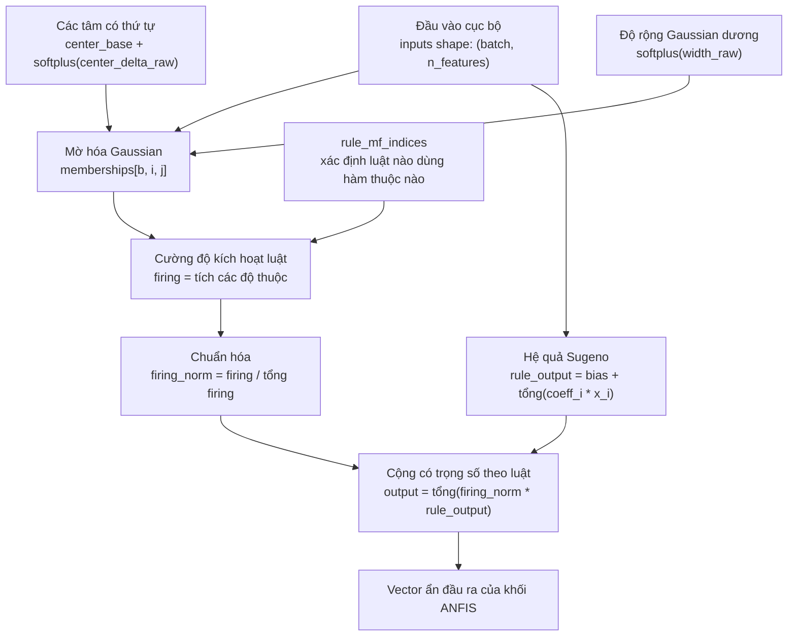
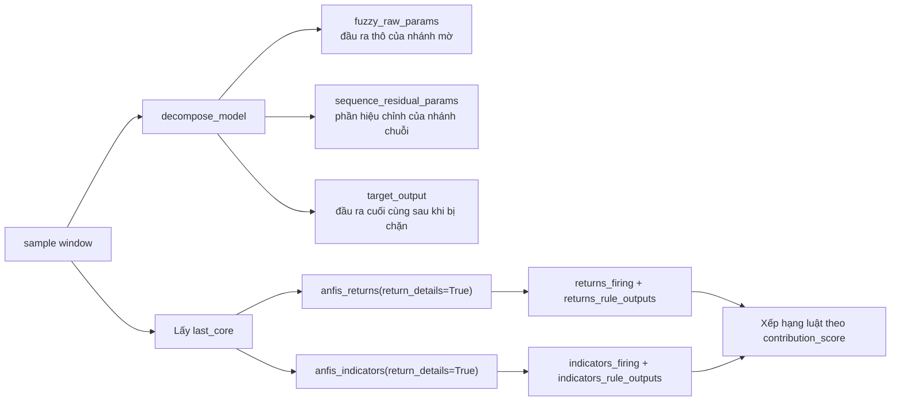

# Sơ đồ mô hình `run_feature_group_anfis_clean.py`

Tài liệu này bám sát phiên bản mới nhất của mô hình trong file `run_feature_group_anfis_clean.py`, chủ yếu theo các hàm:

- `build_model(...)`
- `reconstruct_ohlc(...)`
- `build_decompose_model(...)`
- `analyze_sample(...)`

## Sơ đồ tổng quan



## Sơ đồ chi tiết toàn pipeline



## Sơ đồ chi tiết bên trong một khối `OrderedFeatureGroupANFIS`



## Sơ đồ phục vụ giải thích nội bộ



## Tóm tắt tensor quan trọng

| Thành phần | Ý nghĩa | Kích thước khái quát |
|---|---|---|
| `sequence_input` | Cửa sổ chuỗi đầu vào | `(B, T, F)` |
| `last_core_features` | Bước cuối của 6 đặc trưng lõi | `(B, 6)` |
| `returns_slice` | 4 đặc trưng cho ANFIS returns | `(B, 4)` |
| `indicator_slice` | 2 đặc trưng cho ANFIS indicators | `(B, 2)` |
| `fuzzy_raw_params` | 4 tham số thô do nhánh mờ dự đoán | `(B, 4)` |
| `sequence_residual_params` | 4 tham số hiệu chỉnh do nhánh chuỗi dự đoán | `(B, 4)` |
| `raw_target_params` | Tổng của hai nhánh | `(B, 4)` |
| `target_output` | 4 tham số sau khi bị chặn vào miền hợp lệ | `(B, 4)` |
| `predicted OHLC` | Giá Open/High/Low/Close đã dựng lại | `(B, 4)` |

## Ý nghĩa của 4 đầu ra cuối cùng

| Thành phần | Nghĩa |
|---|---|
| `close_ret` | Tỉ lệ biến động của Close kế tiếp so với `current_close` |
| `open_gap` | Tỉ lệ biến động của Open kế tiếp so với `current_close` |
| `high_buffer` | Mức High vượt lên trên `max(Open, Close)` trong không gian log |
| `low_buffer` | Mức Low đi xuống dưới `min(Open, Close)` trong không gian log |

## Công thức dựng lại OHLC

```text
pred_close = current_close * (1 + close_ret)
pred_open  = current_close * (1 + open_gap)
body_high  = max(pred_open, pred_close)
body_low   = min(pred_open, pred_close)
pred_high  = body_high * exp(high_buffer)
pred_low   = body_low * exp(-low_buffer)
```

Hệ quả trực tiếp của cách dựng này là:

- `pred_high >= max(pred_open, pred_close)`
- `pred_low <= min(pred_open, pred_close)`

Nghĩa là mô hình mới bảo đảm hình học OHLC hợp lệ ngay từ cấu trúc đầu ra, không cần thêm luật phạt bên ngoài.
